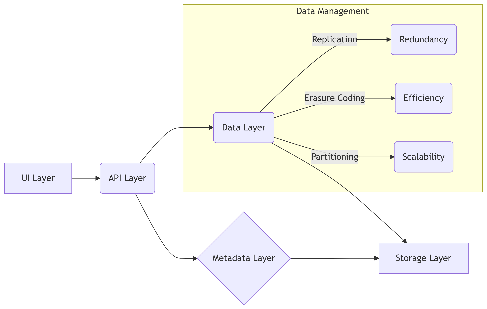

# Cloud Storage Design


# Cloud Storage Design: A Deep Dive

Cloud storage has become an indispensable part of modern computing,
offering scalability, accessibility, and cost-effectiveness unmatched by
traditional on-premise solutions. However, designing a robust and
efficient cloud storage system is a complex undertaking, requiring
careful consideration of numerous factors. This post delves into the
architectural nuances of cloud storage design, exploring key components,
trade-offs, and best practices.

## Architectural Layers

A typical cloud storage system comprises several interconnected layers:

**1. User Interface (UI) Layer:** This is the layer users interact with.
It can range from simple command-line interfaces (CLIs) to sophisticated
web-based portals. The UI handles user authentication, authorization,
data upload/download requests, and metadata management.

**2. API Layer:** This layer provides a programmatic interface for
interacting with the storage system. It translates user requests into
internal operations and returns results back to the user. RESTful APIs
are commonly used, allowing for integration with diverse applications
and platforms.

``` javascript
// Example API request (using JavaScript fetch)
fetch('/api/v1/files/upload', {
  method: 'POST',
  body: fileData, // File data to upload
  headers: {
    'Authorization': 'Bearer <API_TOKEN>'
  }
})
.then(response => response.json())
.then(data => {
  console.log('File uploaded successfully:', data);
})
.catch(error => console.error('Error uploading file:', error));
```

**3. Metadata Layer:** This layer stores crucial information about the
data, such as file names, sizes, timestamps, ownership, and access
permissions. It’s crucial for efficient data retrieval and management.
NoSQL databases like Cassandra or MongoDB are often used for their
scalability and flexibility.

**4. Data Layer:** This is the core of the system, responsible for
storing the actual data. It leverages various techniques for data
redundancy, availability, and durability, including replication and
erasure coding. Consideration must be given to storage mediums (HDDs,
SSDs), data partitioning, and efficient data access strategies.

**5. Storage Layer:** This layer handles physical storage management,
including allocation of storage resources, managing storage capacity,
and handling failures. This layer may involve dealing directly with
hardware or virtualized storage resources.

## Data Management Strategies

Several key strategies govern how data is handled within the cloud
storage system:

- **Data Replication:** Multiple copies of data are stored across
  different servers or data centers. This enhances availability and
  durability, as data loss is mitigated if one server fails. However, it
  increases storage costs.

- **Erasure Coding:** Data is encoded into multiple fragments, with some
  fragments being redundant. This reduces storage requirements compared
  to replication while providing similar levels of fault tolerance.
  Reed-Solomon codes are a common example.

- **Data Partitioning:** Large datasets are divided into smaller,
  manageable chunks. This improves scalability and performance, allowing
  for parallel processing and handling of large requests.

- **Data Consistency:** Guaranteeing data consistency across multiple
  replicas or fragments is a significant challenge. Different
  consistency models exist (strong, eventual, etc.), each with its own
  trade-offs.

## Mermaid Diagrams

### System Architecture



### Data Replication Strategy


## Scalability and Performance

Scalability and performance are paramount considerations. Horizontal
scaling (adding more servers) is crucial for handling increasing data
volumes and user traffic. Efficient data access mechanisms, such as
content delivery networks (CDNs), caching, and optimized data retrieval
algorithms, contribute significantly to performance.

## Security

Security is a vital aspect of cloud storage design. Data encryption
(both in transit and at rest) is essential. Access control mechanisms,
including role-based access control (RBAC) and granular permission
settings, are required to prevent unauthorized access. Regular security
audits and vulnerability assessments are also necessary.

## Summary

Designing a cloud storage system involves careful consideration of
various architectural layers, data management strategies, scalability,
performance, and security. The choice of technologies and algorithms
depends on specific requirements and constraints, demanding a deep
understanding of trade-offs and best practices. This post provided an
overview of the fundamental aspects of cloud storage design, offering
insights into the complexity and importance of this critical
infrastructure component.
