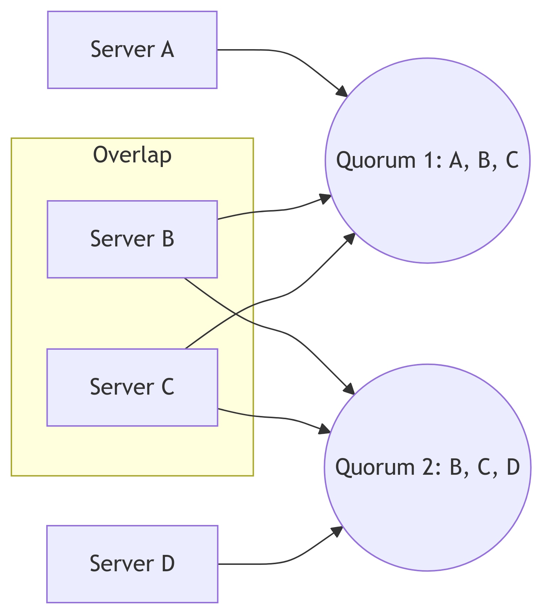
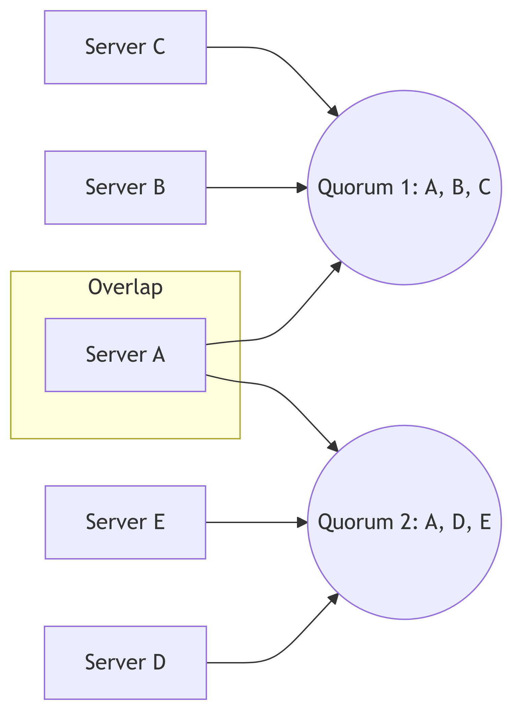

# Quorum-based Systems


# Deep Dive into Quorum-Based Systems: Achieving Consensus in Distributed Environments

Quorum systems are fundamental to the functioning of many distributed
applications, providing a robust mechanism for achieving consensus and
ensuring data consistency in environments where nodes may fail or be
unreliable. This blog post will explore the intricacies of quorum
systems, delving into their mechanisms, various types, applications, and
inherent trade-offs.

## Understanding the Core Concept: Quorum

At its heart, a quorum system is a collection of subsets (quorums) of a
larger set of nodes (e.g., servers, replicas). The defining
characteristic is that any two quorums must have at least one node in
common. This seemingly simple requirement is crucial because it
guarantees that if a decision is reached by one quorum, it automatically
involves at least one member of any other quorum, facilitating
consistency.

Imagine a distributed database replicated across five servers (A, B, C,
D, E). A simple quorum system might define quorums as any three servers.
If a write operation obtains a quorum of (A, B, C), and a subsequent
read operation obtains a quorum of (B, C, D), they share servers B and
C, ensuring data consistency. If a quorum doesn’t overlap, it opens the
possibility of conflicting data versions.



## Types of Quorum Systems

Several types of quorum systems exist, each with its strengths and
weaknesses:

**1. Simple Majority Quorum:**

This is the simplest form, requiring a majority of the nodes to form a
quorum. For example, with five nodes, any three or more nodes constitute
a quorum. It’s easy to understand and implement but can be vulnerable if
a significant number of nodes fail.



**2. Weighted Voting Quorum:**

This extends the simple majority approach by assigning weights to each
node. A quorum is formed when the total weight of participating nodes
exceeds a predefined threshold. This allows for handling situations
where nodes have different capabilities or importance.

**Example (Python):**

``` python
nodes = {
    'A': 2,
    'B': 1,
    'C': 1,
    'D': 2,
    'E': 3
}

threshold = 4

def is_quorum(nodes_involved):
  total_weight = sum(nodes[node] for node in nodes_involved)
  return total_weight >= threshold

print(is_quorum(['A', 'B', 'E'])) # True (2 + 1 + 3 = 6 >= 4)
print(is_quorum(['A', 'B', 'C'])) # False (2 + 1 + 1 = 4 >= 4)
```

**3. Path Quorum Systems:**

These are particularly useful in distributed systems with a hierarchical
or network-like structure. A quorum is defined as a path connecting two
specified nodes, ensuring connectivity and resilience.

**4. Grid Quorum Systems:**

Suitable for distributed systems arranged in a grid topology, quorums
are defined as subsets of nodes that form a connected component in the
grid.

## Applications of Quorum Systems

Quorum systems are ubiquitous in various distributed systems:

- **Distributed Databases:** Ensuring data consistency and availability
  across multiple replicas.
- **Distributed File Systems:** Maintaining data integrity and
  preventing inconsistencies in replicated files.
- **Consensus Protocols:** Paxos, Raft, and other consensus algorithms
  rely on quorum systems for achieving agreement among nodes.
- **Blockchain Systems:** Some blockchain implementations use quorum
  systems to validate transactions and maintain the integrity of the
  blockchain.

## Trade-offs and Considerations

The choice of a quorum system involves trade-offs:

- **Availability vs. Consistency:** Larger quorums increase consistency
  but reduce availability (more nodes need to be operational).
- **Performance:** The size of quorums affects the time required to
  reach a decision. Smaller quorums are generally faster.
- **Complexity:** More sophisticated quorum systems (e.g., weighted
  voting) can add complexity to implementation and management.

## Summary

Quorum systems are powerful mechanisms for achieving consensus and
ensuring data consistency in distributed environments. Different types
of quorum systems offer various trade-offs between availability,
consistency, and performance. Understanding these trade-offs is
essential for selecting the appropriate quorum system for a specific
application. This exploration covered the core concepts, various system
types, practical applications, and important considerations when
designing and deploying quorum-based systems.
