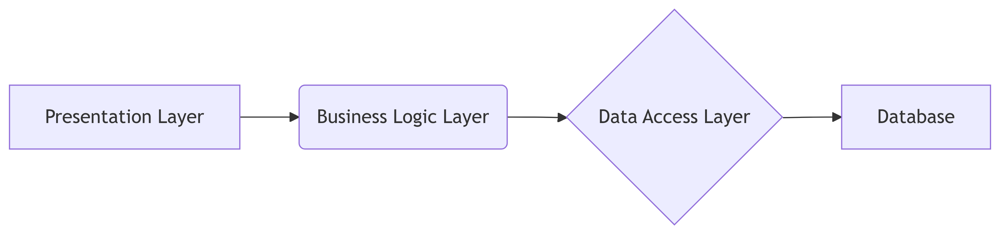
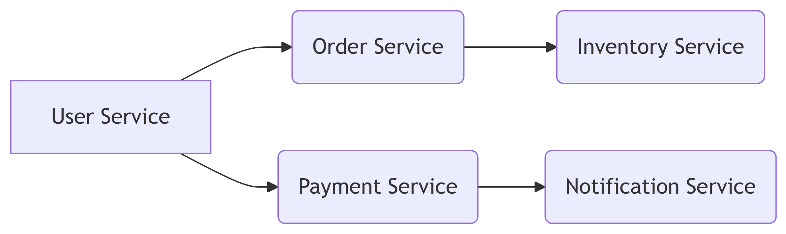
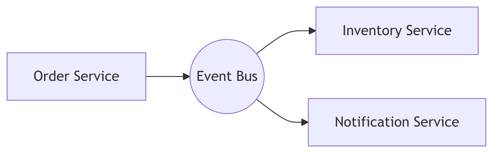
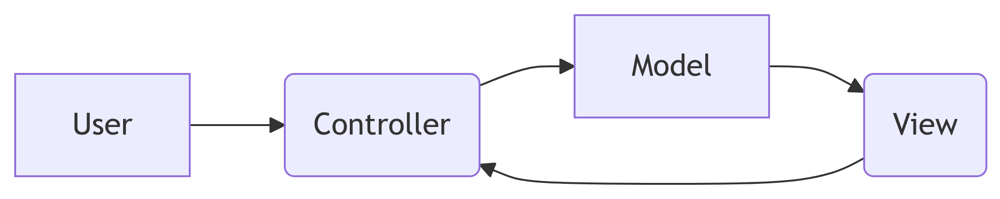
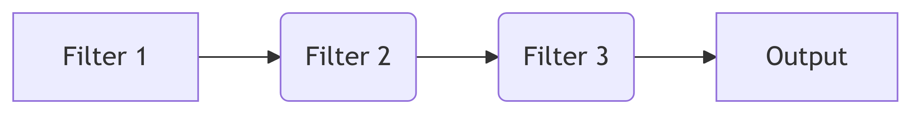

# Architectural Patterns Overview


# Architectural Patterns Overview: A Deep Dive

Architectural patterns are high-level design blueprints that guide the
structure and organization of a software system. Choosing the right
pattern significantly impacts maintainability, scalability, and
performance. This post explores several crucial architectural patterns,
providing explanations, illustrative diagrams, and code snippets where
appropriate.

## 1. Layered Pattern

The Layered pattern, also known as the n-tier architecture, organizes
the system into horizontal layers, each with specific responsibilities.
Common layers include presentation (UI), business logic, data access,
and database. Data flows primarily vertically between layers.

**Advantages:**

- Simple to understand and implement.
- Clear separation of concerns.
- Easier testing and maintenance.

**Disadvantages:**

- Tight coupling between layers can hinder flexibility.
- Performance can suffer due to multiple layers of communication.
- Can become inflexible if not designed carefully.

**Diagram:**



**Code Example (Conceptual Python):**

``` python
# Presentation Layer
def display_data(data):
    print(data)

# Business Logic Layer
def process_data(data):
    # ... business logic ...
    return processed_data

# Data Access Layer
def get_data_from_db():
    # ... database interaction ...
    return data

# Usage
data = get_data_from_db()
processed_data = process_data(data)
display_data(processed_data)
```

## 2. Microservices Architecture

This pattern decomposes the application into small, independent services
that communicate with each other via lightweight mechanisms, often APIs.
Each microservice focuses on a specific business function.

**Advantages:**

- Highly scalable and fault-tolerant.
- Independent deployments and updates.
- Technology diversity.

**Disadvantages:**

- Increased complexity in deployment and management.
- Inter-service communication overhead.
- Distributed debugging and tracing challenges.

**Diagram:**



## 3. Event-Driven Architecture

This pattern relies on the production, detection, and consumption of
events. Components communicate asynchronously through an event bus or
message queue. Changes in one part of the system trigger events that
other parts react to.

**Advantages:**

- Loose coupling between components.
- High scalability and responsiveness.
- Enhanced resilience.

**Disadvantages:**

- Debugging and tracing can be complex.
- Event ordering and consistency need careful management.

**Diagram:**



## 4. Model-View-Controller (MVC)

A widely used pattern for building user interfaces, MVC separates the
application into three interconnected parts: Model (data and business
logic), View (user interface), and Controller (handles user input and
updates the model).

**Advantages:**

- Clear separation of concerns.
- Easier testing and maintenance.
- Promotes code reusability.

**Disadvantages:**

- Can become complex in large applications.
- Not suitable for all types of applications.

**Diagram:**



## 5. Pipe and Filter

This pattern arranges components in a linear sequence. Each component
(filter) processes the input data and passes the result to the next
component (pipe).

**Advantages:**

- Easy to understand and implement.
- Simple to add or remove components.
- High throughput.

**Disadvantages:**

- Limited flexibility.
- Difficult to handle complex interactions.
- Error handling can be challenging.

**Diagram:**



## Summary

This post provided an overview of five common architectural patterns:
Layered, Microservices, Event-Driven, MVC, and Pipe and Filter. Each
pattern offers unique advantages and disadvantages, and the choice of
pattern depends heavily on the specific requirements and constraints of
the project. Understanding these patterns is crucial for designing
robust, scalable, and maintainable software systems.
